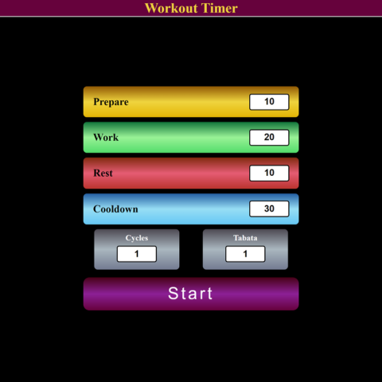

# Workout-Timer
This project first starter out as a simple countdown timer but escalated into a full workout Tabata-style timer.

## Table of contents

- [Overview](#overview)
  - [The challenge](#the-challenge)
  - [Screenshot](#screenshot)
  - [Links](#links)
- [My process](#my-process)
  - [Built with](#built-with)
  - [What I learned](#what-i-learned)
  - [Continued development](#continued-development)
  - [Useful resources](#useful-resources)
- [Author](#author)

## Overview

### The challenge

When I finally decided to put this project down, I would have included the following into the project:
  - HTML Structure: 
    - well-structured to represent the timer and user interface components
  - CSS Styling: 
    - design an aesthetically pleasing and responsive user interface
  - JavaScript Functionality: 
    - include handling user input, updating the display dynamically, and controlling the timer based on different workout phases
  - Object-Oriented Programming: 
    - to organize Javascript code for project maintainability
  - Event Handling: 
    - utilize event listeners to capture user interactions with buttons and trigger corresponding functions
  - Dynamic Timer Display: 
    - update the timer display dynamically, reflecting the current phase and time remaining in minutes and seconds
  - User Experience: 
    - visually indicate the current phase, and use appropriate transitions/animations
  - Customization Options: 
    - allow users to customize the workout parameters
  - Validation and Error Handling: 
    - implement input validation to handle negative numbers or non-numeric inputs
  - Responsive Design: 
    - design the application to be responsive, ensuring it works well on various devices and screen sizes.

### Screenshot



### Links

- Live Site URL: [Workout Timer](https://caius-scipio.github.io/WorkoutTimer/)

## My process

### Built with

- Semantic HTML5 markup
- CSS custom properties
- JavaScript

### What I learned

  - Reinforced the practical aspects of web development
  - Interactive user interface
  - Code modularity (classes) and Organization: increase maintainability and readability
  - Time management with JavaScript: handled time related events and operations

Here is some code I am particularly proud of, or think was interesting:

```css
.container--amber {
  background: linear-gradient(var(--amberDark), var(--amberLight), var(--amber));
}
```
The logic of switching between work and rest cycles followed by a cooldown rest period and then repeating that for each Tabata
```JS
nextPhase(currentTime, count) {
  if (this.currentPhase === "Prepare") {
    ...
  }
  else if (this.currentPhase === "Work") {
    ...
  }
  else if (this.currentPhase === "Rest") {
    ...
    if (this.cycles > 0) {
      ...
    }
    else if (this.cycles === 0) {
      ...
    }
  }
  else if (this.currentPhase === "Cooldown") {
    ...
    if (this.tabatas > 0) {
      ...
    }
    else {
      ...
    }
  }
}
```

### Continued development

Here are a few things I'd like to add in the future:
  - Speech synthasis to phase transitions
  - An audible tick or vocal 3 second countdown for each phase
  - Add a toggle for a digital or analog clock
  - Add a progress bar for each phase and or workout

### Useful resources

- [w3schools](https://www.w3schools.com)

## Author

- Website - [Caius Scipio](https://caius-scipio.github.io/Portfolio/)